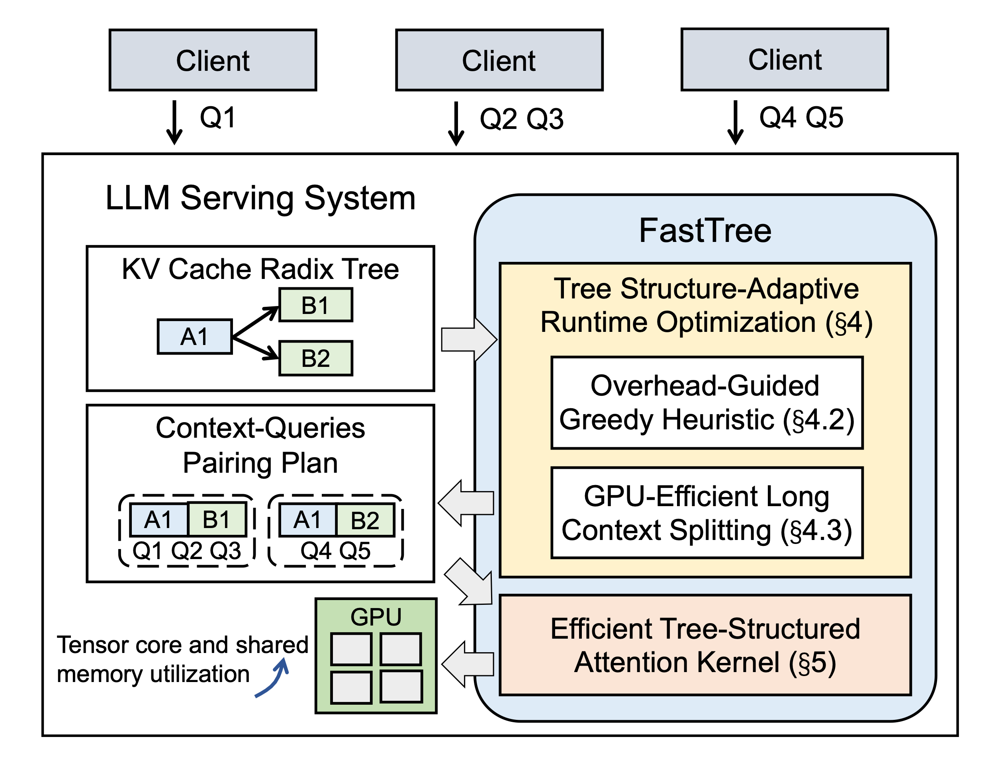
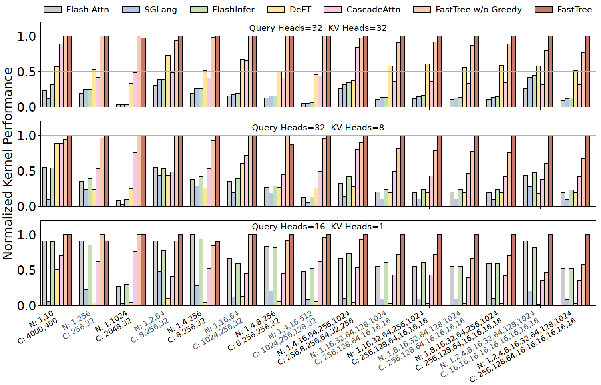

# FastTree

This repository provides the artifact for ***[MLSys'25]** FastTree: Optimizing Attention Kernel and Runtime for Tree-Structured LLM Inference*.

FastTree is implemented as an SGLang plugin to accelerate attention computation with the given radix tree for KV cache. This repository includes the kernel benchmark code from the paper, as well as end-to-end benchmark scripts (still being organized and to be released).

<p align="center">
  
</p>
<p align="center"><b>System overview of FastTree.</b></p>

## Get Started

To reproduce the key kernel performance results from the paper, simply run the provided script:

```sh
./kernel_bench/run.sh
```

This script:
* Builds a Docker image with all required dependencies.
* Benchmarks FastTree and all baselines across different configurations.
* Generates the performance figure at `kernel_bench/norm_perf.pdf`.

The expected output resembles:

<p align="center">
  
</p>
<p align="center"><b>Normalized performance of FastTree and baselines across various tree configurations. N: node number of each level. C: per-node context length of each level.</b></p>

Our evaluations in the paper use an NVIDIA H100 GPU. Since FastTree is implemented with Triton and does not leverage Hopper-specific features, it should work on other GPUs. However, the provided hyperparameters are only tuned for H100.

## Citation

If you find this work useful, please cite:

```bibtex
@inproceedings{pan2025fasttree,
  title = {FastTree: Optimizing Attention Kernel and Runtime for Tree-Structured LLM Inference},
  author = {Pan, Zaifeng and Ding, Yitong and Guan, Yue and Wang, Zheng and Yu, Zhongkai and Tang, Xulong and Wang, Yida and Ding, Yufei},
  booktitle = {Proceedings of Machine Learning and Systems},
  year = {2025}
}
```